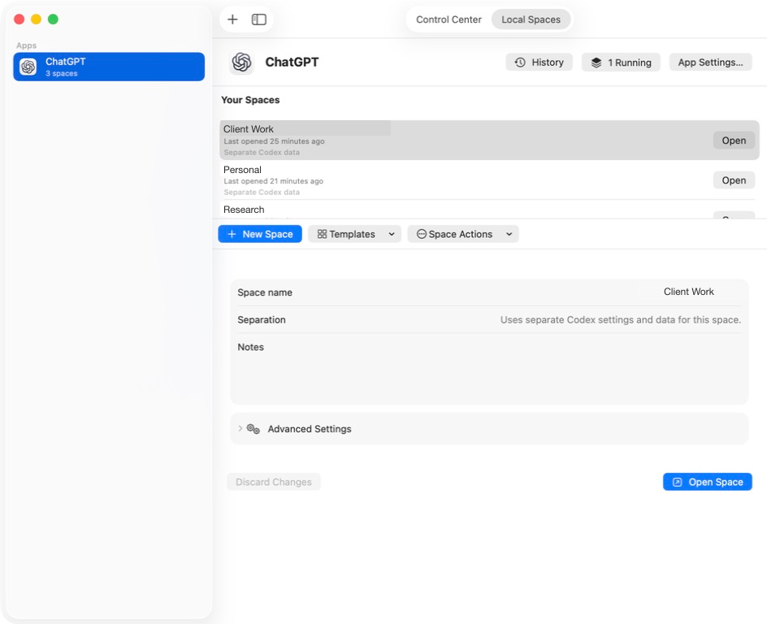

# Parallax

[](https://github.com/38st/Parallax/actions/workflows/ci.yml)
[](https://www.apple.com/macos/)
[](LICENSE)

Parallax is a macOS app for opening separate local app spaces and tracking AI
accounts on one Mac. Local Spaces keeps distinct launch configurations and
best-effort app-data locations for Chromium-based browsers and the OpenAI Codex
desktop app. The preview account tracker reads status from locally installed
Codex and Claude command-line tools after the provider's normal sign-in flow.

Each tracked Codex account uses its own local `CODEX_HOME`. Claude Code instead
uses one credential shared by the current macOS user. Parallax keeps Claude
configuration and saved-session state in a record-specific `CLAUDE_CONFIG_DIR`,
but signing in changes that shared Claude Code identity, so only one Claude
tracking record can be active.

Claude desktop spaces receive separate local app-data and configuration paths,
but the provider can still share login state through macOS. Parallax does not
copy or merge conversation history between spaces.

Parallax does not synchronize organization seats or members, change provider
allocations, share credentials between people, or override provider limits.
Enterprise seat management, recommendations, and provider-side mutations are
explicitly deferred. See the [product contract](docs/PRODUCT_CONTRACT.md) for
the supported, preview, and deferred scope.



## Project status

Parallax is under active development and is being shared as a source preview.
Local Spaces is the supported macOS product surface; local AI account tracking
is a preview. There is no supported binary release yet. Account tracking is
local metadata, not a system of record for billing, access control, seat
ownership, or compliance decisions.

Parallax provides **best-effort configuration isolation**, not an operating
system security boundary. A launched application can ignore an isolation
option, connect to an existing singleton process, or continue to use resources
shared by the current macOS account. See
[Isolation and data ownership](docs/ISOLATION_AND_DATA.md) before relying on a
profile for sensitive separation.

## Features

- Local account inventory with separate Codex ChatGPT homes and one current
  macOS-user Claude Code identity, live Codex rate-limit and token-activity
  refreshes, Claude `/usage` session and weekly limits, provider-supplied plan
  details when available, and last-checked timestamps. The UI does not present
  an unverified reset date as provider truth.
- Searchable local account and provider views. Removing a tracking record does
  not sign out, cancel a subscription, or modify a provider account.
- Stable per-application and per-profile storage identities that do not change
  when visible names change.
- Recommended Chromium, Claude, and Codex isolation settings with explicit
  overrides.
- Launch lifecycle tracking from request through confirmed process termination.
- Transactional clear, duplicate, remove, archive, delete, and storage
  relocation operations for Parallax-managed data.
- Metadata import review and conflict resolution, including explicit approval
  before an imported launch configuration can run.
- Versioned library persistence, stale-writer rejection, migration receipts,
  verified recovery backups, and crash recovery.
- Multiple windows with field-level edit merging and visible conflict handling.
- Portable exports for library metadata, settings/templates, or both.

## Requirements

- macOS 14.0 (Sonoma) or later
- Apple Silicon or Intel Mac
- Xcode 16 or newer, including the Swift 6 toolchain
- Git

Parallax launches other applications already installed on the Mac. Compatibility
with a profile’s arguments and environment ultimately depends on the launched
application.

## Install on a Mac

Parallax does not yet publish a signed and notarized download. For the current
source preview, build the app on the Mac where it will run.

1. Install Xcode 16 or newer from the Mac App Store, open it once to finish
   setup, and confirm that Terminal can find Swift 6:

   ```bash
   swift --version
   ```

2. Clone Parallax, run its tests, and assemble a verified local app:

   ```bash
   git clone https://github.com/38st/Parallax.git
   cd Parallax
   swift test
   ./script/build_and_run.sh build
   ```

3. Open the output folder:

   ```bash
   open dist
   ```

4. Drag `Parallax.app` into **Applications**, then launch it from there.

The app produced by `build` is a native-architecture development build with an
ad-hoc signature. It is suitable for evaluating Parallax on the Mac that built
it, but it is not a distributable release. Do not send that `.app` to someone
else; they should build their own copy from source until a signed and notarized
release is available.

To install or update the single canonical source build, run:

```bash
cd Parallax
git pull --ff-only
swift test
./script/build_and_run.sh install
```

The install command safely replaces `/Applications/Parallax.app`. Local bundles
created by `build` stay available under `dist/` for inspection, but that folder
is excluded from Spotlight so it does not create another Command-Space result.

## First run

For a quick tour:

1. Open **Local Spaces** to add a supported browser or the Codex desktop app,
   create a named space, and open it.
2. Open **Control Center → Accounts** to add, sign in to, or refresh an isolated
   Codex account or the current macOS-user Claude Code account.
3. Review **Overview**, **People**, **Providers**, and **Activity** for the local
   account records and provider status that Parallax has read on this Mac.

Removing an account from Control Center removes only Parallax's local tracking
record. It does not sign out, cancel a subscription, or change anything in the
provider's admin system.

Claude tracking uses one sign-in shared by the current macOS user. Parallax
keeps legacy Claude records and their configuration directories, but allows
only one active Claude tracking record and does not treat those directories as
independent credentials.

Parallax does not update itself. Source installations must be rebuilt manually
as described above.

The packaging script supports local app bundles, release artifacts, and
verification. Release modes, credentials, architecture checks, DMG installation,
and the manual update procedure are documented in
[Build and release](docs/BUILD_AND_RELEASE.md).

## Data at a glance

The v2 library metadata file is:

```text
~/Library/Application Support/Parallax/library.json
```

The default managed base storage root is:

```text
~/Library/Application Support/Parallax/Profiles
```

Account-tracker Codex homes are stored separately from Local Spaces at:

```text
~/Library/Application Support/Parallax/AccountSessions/<account-id>/CodexHome
```

Account-tracker Claude homes are stored alongside them at:

```text
~/Library/Application Support/Parallax/AccountSessions/<account-id>/ClaudeConfig
```

Parallax supplies that path to the installed Claude Code command-line tool and
reads its non-persistent `/usage` output. Parallax does not inspect or copy
Claude OAuth tokens itself.

Within a configured base root, Parallax owns only its UUID-based namespace:

```text
<base>/.parallax/
├── Applications/<application-storage-id>/Profiles/<profile-storage-id>/
│   ├── UserData/
│   └── CodexHome/
├── Archives/<application-storage-id>/<profile-storage-id>/
└── Transactions/
```

An application can use a different base root. Explicit absolute user-data and
`CODEX_HOME` paths are external data: Parallax passes them to the application
but does not copy, relocate, archive, clear, or delete them.

Read [Isolation and data ownership](docs/ISOLATION_AND_DATA.md) for the exact
effect of every data action and export. Read
[Library migration and recovery](docs/MIGRATION_AND_RECOVERY.md) before moving
an existing library, restoring a backup, or troubleshooting a migration.

## Project layout

```text
Sources/Parallax/
├── App/            SwiftUI scenes, commands, and app lifecycle
├── Models/         Versioned library, applications, profiles, and settings
├── Services/       Launch compilation, import validation, relinking, exports
├── Stores/         Library coordination, transactions, recovery, persistence
├── Support/        Filesystem, path containment, logging, parsing, hashing
├── Resources/      Swift Package resources included in app artifacts
└── Views/          Multi-window SwiftUI interface
Tests/ParallaxTests/
├── Fixtures/       Migration, import, and compatibility fixtures
└── *.swift         Unit, integration, failure-injection, and UI-model tests
```

## Contributing and support

Bug reports and feature requests are welcome through
[GitHub Issues](https://github.com/38st/Parallax/issues). See
[CONTRIBUTING.md](CONTRIBUTING.md) for development setup and project
conventions, and review the project [Code of conduct](CODE_OF_CONDUCT.md).

Do not report vulnerabilities or sensitive user data in a public issue. Follow
the private reporting process in [SECURITY.md](SECURITY.md).

## License

Parallax is available under the [MIT License](LICENSE).

Parallax is an independent project and is not affiliated with or endorsed by
OpenAI, Apple, Google, or other browser vendors.
