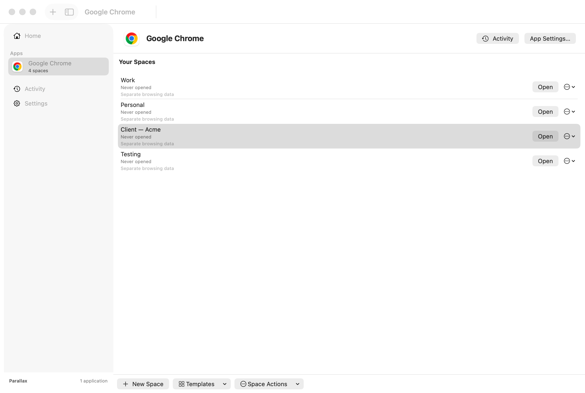
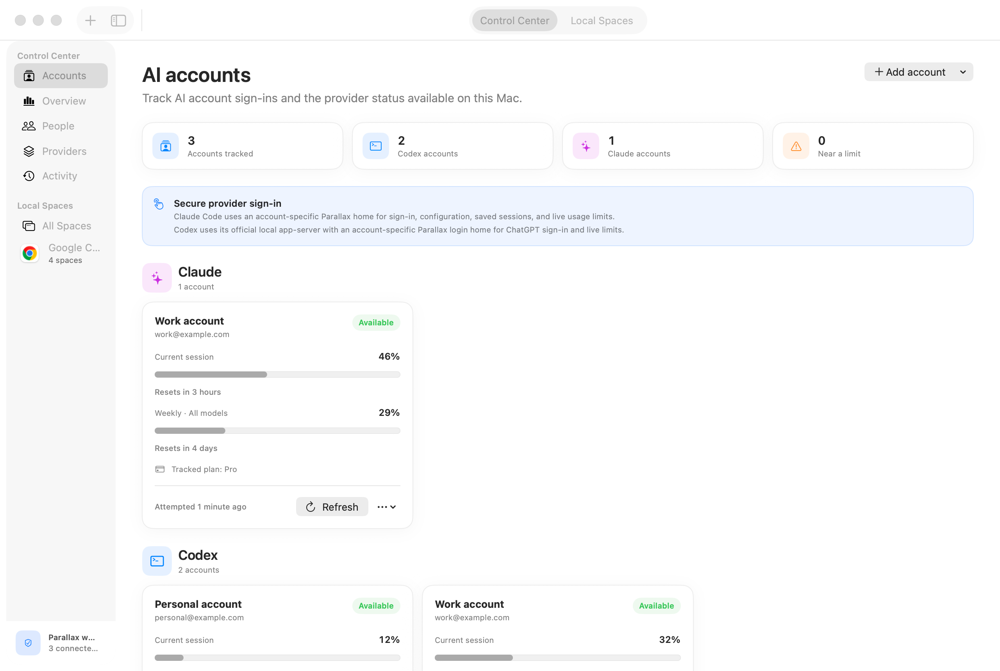

<div align="center">

# Parallax

**Separate, named spaces for the apps you use every day — on one Mac.**

Open Chrome, Brave, Edge, the OpenAI Codex desktop app, Claude Desktop, or any
other app as distinct spaces with their own data folders, and keep an eye on
your local Codex and Claude accounts from one place.

[](https://www.apple.com/macos/)
[](https://www.swift.org)
[](LICENSE)
[](docs/PRODUCT_CONTRACT.md)



</div>

> [!NOTE]
> Parallax is a **source preview**. Local Spaces is the supported surface; the
> account tracker and Shared History are previews. There is no signed download
> yet — build it from source on the Mac where it will run. Parallax separates
> configuration and data folders on a best-effort basis; it is **not** a sandbox
> or a security boundary.

## Contents

- [Why Parallax](#why-parallax)
- [Features](#features)
- [What Parallax is not](#what-parallax-is-not)
- [Install from source](#install-from-source)
- [First run](#first-run)
- [Share history between accounts](#share-history-between-accounts)
- [Where your data lives](#where-your-data-lives)
- [Safety and recovery](#safety-and-recovery)
- [Development](#development)
- [Documentation](#documentation)
- [Contributing and license](#contributing-and-license)

## Why Parallax

- **Keep identities apart.** Run work, personal, client, and throwaway spaces
  of the same browser or AI app side by side, each pointed at its own data
  folder.
- **Open exactly what you mean.** Launch a space with one click, see which
  instances are running from the menu bar, and quit the exact instance you
  picked.
- **Change things without fear.** Clearing, duplicating, archiving, deleting,
  or moving a space's data runs as a staged transaction that either finishes,
  rolls back, or stops in recovery — it never guesses.

## Features

### Local Spaces — supported

- **Named spaces per app** with stable storage identities: renaming a space or
  an app never moves its data.
- **Recommended isolation, with explicit overrides.** Chromium-based browsers
  and Claude Desktop get their own `--user-data-dir`, the Codex app gets its
  own `CODEX_HOME`, and Claude Desktop also gets its own `CLAUDE_CONFIG_DIR`.
  Point any of them at a folder of your own and Parallax treats it as yours.
- **More apps with real separation.** Vivaldi, Opera, and Chromium are
  detected as Chromium browsers. Firefox spaces can get their own
  `-profile` folder with `-no-remote`, and VS Code, Cursor, Windsurf, and
  VSCodium spaces their own `--user-data-dir` and `--extensions-dir`. These are
  written into a space's arguments when you create it from a recommended
  template or apply recommended settings, so existing spaces never change on
  their own.
- **Know before you launch.** Adding an app shows what each space keeps
  separate and whether the app can run several copies at once. After a
  launch, Parallax notes when the app has not written to the space's data
  folder yet — a hint, not proof, that it ignored the isolation option.
- **Open Terminal in This Space.** Opens Terminal with that space's
  `CODEX_HOME` or `CLAUDE_CONFIG_DIR`, so the `codex` and `claude` command-line
  tools use the same separate account. Your shell startup files can still
  override the value.
- **Links to spaces.** `parallax://open?space=…` links (Copy Link to Space)
  open a space from Shortcuts, Raycast, or a browser, and always ask first.
- **Launch tracking** from request to confirmed exit, running instances in the
  menu bar, and Recent Activity with crash attribution. Parallax can reopen a
  space automatically after a crash that macOS confirms; recovery is
  rate-limited and can be turned off in Settings.
- **Guarded data actions** — clear, duplicate, archive, delete, and move
  storage — that are blocked while a space is running and are journaled, so an
  interrupted operation is finished, rolled back, or stopped in recovery.
- **Secrets as Keychain references.** Store sensitive environment values in
  the Keychain; Parallax resolves them only while preparing a launch, and
  flags secret-looking arguments and plaintext values.
- **Reviewed imports and careful exports.** Imported launch configurations
  must be approved before they can run. Exports never contain Keychain secret
  values and ask before including sensitive plaintext.
- **Templates, multiple windows, and two languages.** Start spaces from
  templates, edit in several windows with field-level merging, and use the app
  in English or Spanish.

### Shared local Code history — preview

Histories stay separate by default. Optionally link Claude Desktop or Codex
spaces to synchronize saved active local Code chats before opening a linked
space. Each chat keeps its identity, and each space keeps its own login and
account limits. Messages and tool results become visible to every linked
account.

Claude's Chat tab, ChatGPT chats, and cloud or remote conversations are outside
this preview. See [setup below](#share-history-between-accounts) and
[Shared History](docs/SHARED_HISTORY.md) for compatible formats and recovery.
For a single Claude chat, use
[Copy Claude Conversation](docs/CLAUDE_CONVERSATION_COPY.md) instead.

### AI account tracker — preview

- **Codex and Claude Code accounts**, each with its own local `CODEX_HOME` or
  `CLAUDE_CONFIG_DIR`, signed in through the provider's normal flow.
- **Usage at a glance**: session and weekly limits, reset times, plan, and
  token activity as reported by the locally installed provider tools, with
  last-checked times. Accounts are re-checked about every five minutes and
  after the Mac wakes; failing checks back off.
- **Local metadata only.** Removing an account from Parallax never signs out,
  cancels a subscription, or changes anything with the provider.



## What Parallax is not

- **Not an isolation boundary.** Spaces run under your macOS account. An app
  can ignore an option, reuse a running instance, or reach shared resources
  such as the login Keychain. Use separate macOS accounts or a virtual machine
  when you need real separation. See
  [Isolation and data ownership](docs/ISOLATION_AND_DATA.md).
- **Not an admin console.** Parallax does not manage organization seats or
  members, change provider allocations or billing, share credentials between
  people, or override provider limits. See the
  [product contract](docs/PRODUCT_CONTRACT.md) for what is supported, in
  preview, and deliberately out of scope.
- **Not affiliated** with OpenAI, Anthropic, Apple, Google, Microsoft, Brave,
  or other vendors.

## Install from source

**Requirements:** macOS 14 (Sonoma) or later on Apple silicon or Intel, Xcode
16 or later with the Swift 6 toolchain, and Git.

```bash
git clone https://github.com/38st/Parallax.git
cd Parallax
swift test
./script/build_and_run.sh build
open dist
```

Drag `Parallax.app` from `dist` into **Applications** and open it.

To build and replace `/Applications/Parallax.app` in one step, run
`./script/build_and_run.sh install`. To update later, pull and rebuild:

```bash
git pull --ff-only
swift test
./script/build_and_run.sh install
```

The app you build is an ad-hoc signed development build for the Mac that
built it — don't share it. Parallax does not update itself. Packaging modes,
architectures, and release signing are described in
[Build and release](docs/BUILD_AND_RELEASE.md).

## First run

1. **Local Spaces → Choose an App** (the **+** button, or ⇧⌘A). Pick a
   browser, the Codex app, Claude Desktop, or any other app.
2. **New Space.** Pick a template such as Work, Personal, Testing, or
   Throwaway, and name the space.
3. **Open Space.** The menu bar shows what is running; quit or bring forward a
   specific instance from there.
4. **Control Center → Accounts** (optional). Add a Codex or Claude account and
   sign in through the provider. **Overview**, **People**, **Providers**, and
   **Activity** summarize what Parallax has read on this Mac.

## Share history between accounts

1. Sign in to each account in its own Parallax space. For Claude, open the
   **Code** tab at least once to initialize its local history directory.
2. Check that the chats you want are present in the intended Parallax space.
   **The regular Claude app can have different history.** Shared History uses
   the selected spaces; it does not automatically import the regular app's
   chats or offer a primary history that replaces the others.
3. Quit every instance of that provider app, including background windows.
4. Select a space, choose **Space Actions → Shared History…**, select the
   other spaces, and click **Share History**. This combines their active local
   chats while keeping distinct conversations separate.
5. Open the account's space you want to use. Parallax synchronizes the linked
   histories before launch. Quit the provider app before switching to another
   linked space. Claude may ask you to review imported history before continuing.

A group can contain two to eight spaces of the same app. Use Parallax-managed
storage; custom external history folders are outside this workflow. Codex also
requires an installed Codex CLI to refresh its local chat list. Supported
formats and storage requirements are in [Shared History](docs/SHARED_HISTORY.md).

New messages can synchronize as you switch accounts. Conflicting edits or a
previously shared chat being deleted or archived stop synchronization for
review; archives and deletions are not propagated. **Turn Off Sharing** keeps
chats already copied. Sharing history does not copy project files or worktrees.

## Where your data lives

| What | Location |
| --- | --- |
| Library (apps and spaces) | `~/Library/Application Support/Parallax/library.json` |
| Shared History opt-in and sync metadata | `~/Library/Application Support/Parallax/shared-history.json` |
| Settings and templates | `~/Library/Application Support/Parallax/Settings/settings.json` |
| Space data (default location) | `~/Library/Application Support/Parallax/Profiles/.parallax/…` |
| Account-tracker homes | `~/Library/Application Support/Parallax/AccountSessions/<account-id>/` |

Inside a storage location, Parallax owns only its own namespace:

```text
<base>/.parallax/
├── Applications/<application-storage-id>/Profiles/<profile-storage-id>/
│   ├── UserData/
│   └── CodexHome/
├── Archives/<application-storage-id>/<profile-storage-id>/
└── Transactions/
```

Folders you configure yourself — an absolute `--user-data-dir`, `CODEX_HOME`,
or `CLAUDE_CONFIG_DIR` outside that namespace — stay yours: Parallax passes
them to the app but never copies, moves, archives, clears, or deletes them.

Exports are portable metadata, not backups: they never include space data or
Keychain secret values. Read
[Isolation and data ownership](docs/ISOLATION_AND_DATA.md) for the exact effect
of every data action and export.

## Safety and recovery

- Every change to the library is checked against the version on disk, so two
  windows or two copies of Parallax cannot silently overwrite each other.
- Destructive changes such as removing an application create a verified
  metadata backup first, and the recovery screen can restore a verified
  backup.
- Data operations and storage moves are journaled; after a crash or power
  loss, Parallax finishes or rolls them back, or stops in recovery and tells
  you what it found.
- Recent Activity can export a sanitized support bundle that leaves out names,
  paths, arguments, environment values, and raw crash reports.

Before moving a library, restoring a backup, or troubleshooting a migration,
read [Library migration and recovery](docs/MIGRATION_AND_RECOVERY.md).

## Development

```bash
swift build
swift test
./script/run_quality_gates.sh          # the local gate set, a few minutes
./script/run_quality_gates.sh --full   # adds coverage, sanitizers, and a packaging rehearsal
```

Parallax has no hosted CI by design: the local gates above are the bar a
change must clear before it is pushed. See the
[release gate](docs/production-readiness/release-gate.md) for what each gate
proves, [CONTRIBUTING.md](CONTRIBUTING.md) for conventions, and
[AGENTS.md](AGENTS.md) for the rules coding agents follow in this repository.

```text
Sources/Parallax/
├── App/        SwiftUI scenes, commands, and app lifecycle
├── Models/     Versioned library, applications, spaces, and settings
├── Services/   Launch compilation, import validation, provider tools, exports
├── Stores/     Library coordination, transactions, recovery, persistence
├── Support/    Filesystem safety, path containment, parsing, hashing
├── Resources/  Localized strings and app icon
└── Views/      Multi-window SwiftUI interface and menu bar
Tests/ParallaxTests/
├── Fixtures/   Migration, import, and compatibility fixtures
└── *.swift     Unit, integration, failure-injection, and UI-model tests
script/         Local quality gates, packaging, and release tooling
```

## Documentation

| Document | What it covers |
| --- | --- |
| [Product contract](docs/PRODUCT_CONTRACT.md) | What is supported, in preview, and out of scope |
| [Isolation and data ownership](docs/ISOLATION_AND_DATA.md) | What a space changes, what it cannot, and every data action |
| [Shared History](docs/SHARED_HISTORY.md) | Link local Code histories, switch accounts, and handle conflicts |
| [Copy a Claude conversation](docs/CLAUDE_CONVERSATION_COPY.md) | Copy one local Code chat into another space |
| [Library migration and recovery](docs/MIGRATION_AND_RECOVERY.md) | Upgrades, backups, restores, and recovery states |
| [Build and release](docs/BUILD_AND_RELEASE.md) | Packaging modes, signing, notarization, and verification |
| [Production readiness](docs/production-readiness/README.md) | Gap register, release gate, and critical journeys |

## Contributing and license

Bug reports and feature requests are welcome through
[GitHub Issues](https://github.com/38st/Parallax/issues). Please read
[CONTRIBUTING.md](CONTRIBUTING.md) and the
[Code of conduct](CODE_OF_CONDUCT.md) first.

Never report a vulnerability or sensitive data in a public issue.

Parallax is available under the [MIT License](LICENSE).
